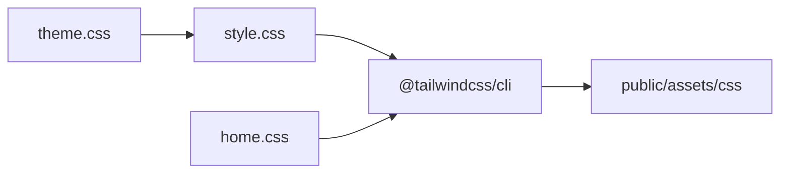

# Plan : Tailwind CSS — thème violet / cosmic (ABS)

## Références design (maquettes fournies)

- Fond quasi noir avec **grille subtile** et **lueur violette** derrière le hero
- **Accents** : violet/lavande pour ambiance + **teal/cyan** pour CTA, liens « Voir tout », notes ★ (mix harmonieux)
- **Typo** : serif élégant pour grands titres et chiffres ; **Inter** pour nav, corps, labels uppercase
- **Cartes** : coins très arrondis, moitié haute en dégradé coloré, badge pays, bloc texte `#16161e`
- **Contraste** : texte clair `#f4f4f5` / gris `#a1a1aa` — assez lisible malgré le dark

## Contraintes (inchangées)

- **Aucune modification** des fichiers `.php`, `.html`, `.js`
- Uniquement : `resources/css/*` (sources), build npm → [`public/assets/css/`](public/assets/css/)
- Classes HTML existantes stylées via **`@apply`** et CSS custom (pas de utilities dans le markup)

## Périmètre thématique

| Zone | Thème |
|------|--------|
| Accueil | Dark violet/cosmic + **étoiles animées** (CSS pur, léger) |
| Connexion, inscription, lieu, avis, pays, profil, 404 | Dark violet/cosmic **sans** étoiles |
| Carte (`body.map-page`) | **Conserver** le cockpit Mapbox actuel — pas de violet global |

Exclusion carte dans le global :

```css
body:not(.map-page) {
  @apply bg-[var(--abs-bg)] text-[var(--abs-text)];
}
```

L’accueil charge `style.css` + `home.css` : les étoiles vivent **uniquement** dans `home.css` (pas chargé ailleurs).

## Palette proposée (`resources/css/theme.css`)

| Token | Valeur | Usage |
|-------|--------|--------|
| `--abs-bg` | `#0a0a0f` | Fond page |
| `--abs-bg-elevated` | `#12121a` | Zones secondaires |
| `--abs-surface` | `#16161e` | Cartes, formulaires |
| `--abs-surface-2` | `#1e1e28` | Hover / bordures internes |
| `--abs-border` | `rgba(167, 139, 250, 0.2)` | Bordures violet léger |
| `--abs-text` | `#f4f4f5` | Texte principal |
| `--abs-text-muted` | `#a1a1aa` | Sous-titres, labels |
| `--abs-violet` | `#8b5cf6` | Accent cosmic, liens secondaires |
| `--abs-violet-glow` | `#a78bfa` | Lueurs, badge hero |
| `--abs-cta` | `#2dd4bf` | Boutons primaires (teal des maquettes) |
| `--abs-cta-hover` | `#14b8a6` | Hover CTA |
| `--abs-gold` | `#fbbf24` | Étoiles de notation (fiche lieu) |

Polices (importées dans `style.css`, sans toucher PHP) :

- **Serif** : `Playfair Display` — `.hero-titre`, `.titre-rubrique`, `.titre-page-avis`, titres cartes
- **Sans** : `Inter` — nav, corps, formulaires, boutons

## Effet étoiles cosmic (accueil seulement — `home.css`)

Mix **statique + animé** (choix utilisateur) :

1. **Couche 1** — `body` (uniquement quand `home.css` est chargé) : dégradé radial violet (`#1e1033` → `#0a0a0f`) + grille CSS (`background-image: linear-gradient(...)`)
2. **Couche 2** — pseudo-élément `body::before` : ~80–120 « étoiles » via `box-shadow` multiples (points blancs/violet pâle, opacités variées)
3. **Couche 3** — `body::after` ou `.accueil-hero::before` : `@keyframes twinkle` (opacité/scale léger, 3–6s, `prefers-reduced-motion: reduce` → animation désactivée)

Hero (classes existantes `.accueil-hero`, `.hero-titre`, `.btn-hero`) :

- Plein écran centré, badge pill optionnel via `::before` sur `.accueil-hero` (« DÉCOUVREZ… ») si faisable sans HTML
- Titre : serif large, mot clé en dégradé violet→teal via `background-clip: text` sur `.hero-titre` entier (pas de `<span>` sans PHP)
- Boutons : pill teal plein + variante outline (`.btn-hero`, `.btn-hero-sec`)

Sections maquettes mappées sur HTML actuel :

| Maquette | Classes existantes |
|----------|-------------------|
| Lieux populaires | `.grille-cartes-lieux`, `.carte-lieu`, `.carte-lieu-illu`, `.carte-lieu-corps` |
| Derniers avis | `.liste-derniers-avis`, `.rda-note`, `.rda-comm` |
| Stats hero | *Non présentes en PHP* — hors scope sauf ajout futur HTML |

## Plan par feuille CSS

### 1. [`style.css`](public/assets/css/style.css) — global dark

- `@import "tailwindcss"` + `theme.css`
- `body:not(.map-page)` : fond, typo, liens violet/teal
- Nav `.site-header` : fond semi-transparent, blur, logo, `.nav-auth` bouton teal pill
- Footer `.site-footer` : fond sombre discret
- Flash `.errors` / `.success` : variantes dark lisibles
- Formulaires / `.btn` : surfaces `#16161e`, focus ring violet
- Profil : `.bloc-profil`, `.liste-avis-profil` en cartes sombres

### 2. [`home.css`](public/assets/css/home.css) — cosmic accueil

- Fond étoiles + nébuleuse (voir ci-dessus)
- Hero, grilles cartes lieux (2 colonnes responsive), liste derniers avis en **carte unique** type maquette
- Liens « Voir tout » : teal + flèche via `::after` sur `.titre-rubrique` si structure le permet

### 3. [`auth.css`](public/assets/css/auth.css)

- Carte centrée sombre, labels uppercase, champs bordure violette, bouton teal

### 4. [`place.css`](public/assets/css/place.css)

- `.place-entete` : overlay dégradé violet/teal
- Formulaire avis : carte arrondie, étoiles dorées, textarea sombre, bouton pill teal

### 5. [`reviews.css`](public/assets/css/reviews.css)

- `.carte-avis-global`, filtres, pagination : alignés sur cartes maquette « Derniers avis »

### 6. [`map.css`](public/assets/css/map.css)

- Refactor Tailwind `@apply` **sans** changer variables `--carte-*` ni couleurs cockpit
- Ne pas hériter du `body:not(.map-page)` violet (déjà isolé par `.map-page`)

## Chaîne de build npm (inchangée)



- `package.json` : `build:css` compile les 6 entrées
- Sources dans `resources/css/` ; **ne pas éditer** les CSS compilés à la main

## Lisibilité (garde-fous)

- Ratio contraste WCAG visé : texte principal ≥ 4.5:1 sur `#0a0a0f`
- Pas de violet clair sur violet foncé pour le corps de texte
- `prefers-reduced-motion` : désactiver scintillement étoiles
- Tester : accueil, lieu, avis, auth, profil, carte

## Livrables

- `package.json` + `resources/css/` (6 sources + `theme.css`)
- `public/assets/css/*.css` régénérés
- README : `npm install` + `npm run build:css`

## Hors périmètre

- Modifier le texte HTML du hero (« inspirez » en italique séparé) — nécessiterait PHP
- Bloc statistiques « 12k+ / 3.4k / 18k » — absent du markup actuel
- Classes Tailwind dans les vues PHP

## Prochaine étape

Quand vous validez ce plan mis à jour, passez en **mode Agent** et demandez d’**exécuter le plan** pour lancer l’implémentation.
