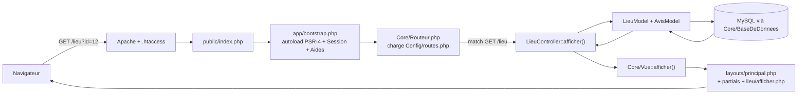

# Architecture

Document de référence pour l'organisation du code de Projet-ABS. À lire avant toute contribution importante.

## Vision générale

Projet-ABS suit une architecture **MVC** (Modèle / Vue / Contrôleur) implémentée à la main, sans framework, conformément aux contraintes du cours. Toutes les requêtes HTTP entrent par **un seul fichier** (`public/index.php`), ce qui permet de centraliser le routage, les sessions et le chargement des classes.



## Conventions de nommage

| Élément | Langue | Pourquoi |
|--|--|--|
| Dossiers structurels (`public`, `app`, `Core`, `Controllers`, `Models`, `Views`, `Config`, `sql`, `docs`, `storage`) | anglais | Vocabulaire universel des frameworks MVC, plus facile pour qui découvre le projet. |
| Sous-dossiers de `Views/` (`accueil`, `connexion`, `lieu`…) | français | Reflètent le domaine métier visible côté utilisateur. |
| Fichiers `.php` et leurs classes | français | Cohérence avec l'interface en français et l'équipe. |
| URLs publiques | français | Visibles par l'utilisateur final. |
| Fichiers CSS / JS dans `public/assets/` | anglais | Standard web (`style.css`, `map.js`…), évite de toucher à la logique JS lors du refactor. |
| Fichiers projet (`README.md`, `LICENSE`, `CHANGELOG.md`, `.htaccess`, `.gitignore`) | anglais | Convention GitHub/Git universelle. |

## Responsabilités par couche

### `app/Core/` — Le noyau

Petit framework maison. Aucune logique métier ici, uniquement des outils techniques :

- **`Routeur.php`** — table `[METHODE, CHEMIN, [Classe, methode]]`, dispatche vers le bon contrôleur, renvoie 404 ou 405.
- **`Controleur.php`** — classe abstraite parente de tous les contrôleurs. Expose `rendre()`, `rediriger()`, `exigerConnexion()`.
- **`Modele.php`** — classe abstraite parente de tous les modèles. Expose `pdo()` partagé.
- **`BaseDeDonnees.php`** — singleton PDO, lit la config depuis `app/Config/bdd.php`.
- **`Vue.php`** — moteur de rendu. Capture la sous-vue dans un buffer, l'enveloppe dans `layouts/principal.php`.
- **`Requete.php`** — wrapper typé sur `$_GET` / `$_POST` / `$_SERVER` (`getInt`, `postString`, `estPost`…).
- **`Reponse.php`** — helpers HTTP : redirections, JSON, 404.
- **`Session.php`** — wrapper sur `$_SESSION` : flash messages, ancien input, utilisateur courant.
- **`Aides.php`** — fonctions globales (`e()`, `tronque_e()`, `starsRatingHtml()`, `displayErrors()`, `displaySuccess()`).

### `app/Controllers/` — Les contrôleurs

Un contrôleur = une **fonctionnalité** (Accueil, Connexion, Lieu, Avis…). Sa responsabilité :

1. Lire les paramètres de la requête (via `$this->requete`).
2. Valider, gérer les redirections, vérifier la session.
3. Appeler les modèles pour récupérer / écrire les données.
4. Appeler `$this->rendre('chemin/vue', $donnees, 'fichier-css')`.

Aucun SQL, aucun HTML dans un contrôleur.

### `app/Models/` — Les modèles

Un modèle = une **entité** ou **agrégat de données** (Utilisateur, Pays, Lieu, Avis). Sa responsabilité :

- Préparer et exécuter les requêtes SQL via `self::pdo()`.
- Retourner des tableaux PHP (les colonnes telles que stockées en BDD).
- Aucune dépendance vers la session ou la requête HTTP.

### `app/Views/` — Les vues

Du HTML + un peu de PHP pour itérer. Une vue ne fait jamais d'accès BDD ni de logique métier ; elle reçoit uniquement les variables préparées par le contrôleur.

- `layouts/principal.php` — squelette HTML + appel des partials + insertion du contenu capturé.
- `partials/` — fragments réutilisables (entête, navigation, pied, messages flash).
- `<feature>/<action>.php` — vues spécifiques à un contrôleur.

### `app/Config/` — La configuration

- **`application.php`** — constantes globales (nom de l'app, environnement).
- **`bdd.php`** — instancie `$pdo` (gitignored, contient les credentials).
- **`mapbox.php`** — jeton Mapbox (gitignored).
- **`routes.php`** — table déclarative des routes (méthode, chemin, contrôleur).

### `public/` — La racine web

Le seul dossier exposé par Apache. Contient :

- `index.php` — front controller (5 lignes : bootstrap puis dispatch).
- `.htaccess` — `mod_rewrite` qui envoie tout vers `index.php` sauf les fichiers existants.
- `assets/` — CSS, JS, images.

## Ajouter une nouvelle route en 3 étapes

Exemple : ajouter une page `/villes` listant les villes.

1. **Créer le modèle** — `app/Models/VilleModel.php` :

   ```php
   class VilleModel extends \App\Core\Modele
   {
       public static function toutes(): array
       {
           $st = self::pdo()->query('SELECT id_ville, nom FROM ville ORDER BY nom');
           return $st->fetchAll(PDO::FETCH_ASSOC) ?: [];
       }
   }
   ```

2. **Créer le contrôleur** — `app/Controllers/VilleController.php` :

   ```php
   class VilleController extends \App\Core\Controleur
   {
       public function index(): void
       {
           $this->rendre('ville/index', [
               'villes'    => \App\Models\VilleModel::toutes(),
               'pageTitre' => 'Villes',
           ]);
       }
   }
   ```

3. **Déclarer la route** dans `app/Config/routes.php` :

   ```php
   ['GET', '/villes', [VilleController::class, 'index']],
   ```

4. **Créer la vue** — `app/Views/ville/index.php` :

   ```php
   <h1>Villes</h1>
   <ul>
       <?php foreach ($villes as $v): ?>
           <li><?= e((string) $v['nom']) ?></li>
       <?php endforeach; ?>
   </ul>
   ```

C'est tout. Aucune autre modification nécessaire (pas de fichier dans `pages/` ou `actions/`, pas d'autoload à éditer — tout est branché par convention).

## Sécurité

- **PDO préparé** partout (jamais de concaténation de variable utilisateur dans une chaîne SQL).
- **`htmlspecialchars`** systématique dans les vues via `e()` ou `tronque_e()`.
- **`password_hash` / `password_verify`** pour les mots de passe.
- **Sessions PHP** pour l'auth ; le cookie de session reste en valeurs par défaut PHP.
- **Front controller + DocumentRoot=public/** : le code applicatif (modèles, controllers, config, SQL) n'est jamais exposé directement.
