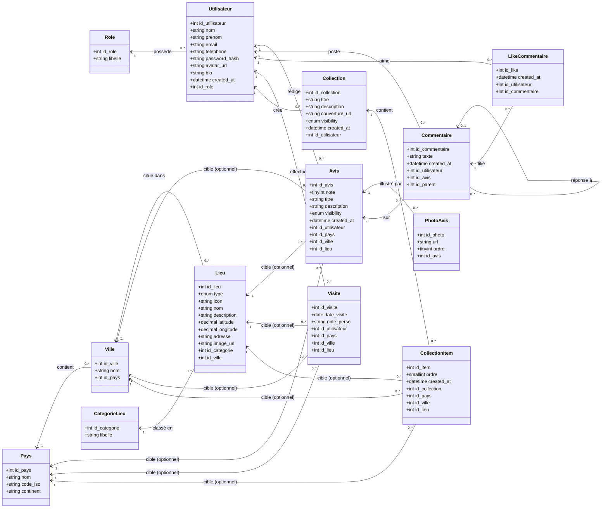

# Diagramme de classes — Projet ABS

Vue UML du modèle de données, basée sur le schéma SQL (`sql/schema/database.sql`).
Rendu directement sur GitHub grâce au support natif de Mermaid dans les fichiers Markdown.

## Lecture du diagramme

- **Avis, Visite, CollectionItem** sont polymorphiques : ils ciblent au choix un Pays, une Ville ou un Lieu (les 3 clés étrangères sont nullables, exclusivité gérée par contrainte métier).
- **Commentaire** est récursif via `id_parent` : permet de répondre à un commentaire (threads).
- **Utilisateur** a un rôle unique (admin, modérateur, utilisateur).
- Hiérarchie géographique : **Pays → Ville → Lieu**, suppression en cascade.
- **CategorieLieu** classe les lieux : musée, restaurant, monument, etc.
